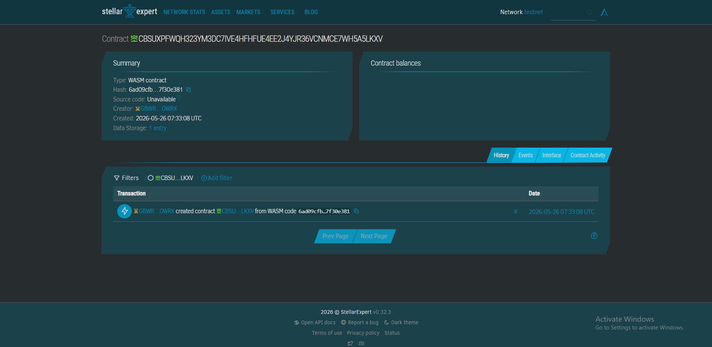

# My Soroban Project

A Stellar Soroban smart contract project.

## Requirements

Before you begin, ensure you have the following installed:
- [Rust](https://www.rust-lang.org/) (v1.75 or later)
- [Soroban CLI](https://soroban.stellar.org/docs/getting-started/setup#install-the-soroban-cli)

## Getting Started

### 1. Run Unit Tests
To make sure everything is working fine and your logic passes local tests, run:
```bash
cargo test

## Contract ID
CBSUXPFWQH323YM3DC7IVE4HFHFUE4EE2J4YJR36VCNMCE7WH5A5LKXV

!

## Contract Link
https://stellar.expert/explorer/testnet/contract/CBSUXPFWQH323YM3DC7IVE4HFHFUE4EE2J4YJR36VCNMCE7WH5A5LKXV

